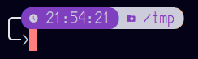
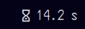

# i3_config
Config i3+i3status.py for quick start on new instalation (Debian based)


# KEYBOARD CONFIGURATION FILE [/etc/default/keyboard](https://github.com/Alex2182/i3_config/blob/main/keyboard)

XKBLAYOUT="us" add ",ru"
XKBOPTIONS="" add "grp:alt_shift_toggle"

You can also create a new file under /etc/sudoers.d name it as you wish(I named it 'shutdown'), and put the following lines inside:

# Allows me to shutdown the system without a password
yourUserName ALL = NOPASSWD: /sbin/halt, /sbin/reboot, /sbin/poweroff


# test configuration
```bash
sudo setupcon
```
# make changes
```bash
sudo setupcon -k -f
```
# 2 Enable tap for laptops
Make a new file [touchpad-tap.conf](https://github.com/Alex2182/i3_config/blob/main/touchpad_tap.conf)
```bash
sudo nano /etc/X11/xorg.conf.d/touchpad-tap.conf
```
and add the following:

Add below text
```bash
Section "InputClass"
        Identifier "libinput touchpad catchall"
        MatchIsTouchpad "on"
        MatchDevicePath "/dev/input/event*"
        Driver "libinput"
        Option "Tapping" "on"
EndSection
```
# 3 Backlight control for laptops
```bash
sudo apt install light
sudo chmod +s /usr/bin/light
```
# 4 Prepare for i3wm installation
```bash
sudo apt install suckless-tools arandr autorandr j4-dmenu-desktop \
python3-pip python3-dev lm-sensors git curl nitrogen flameshot \
libsensors4-dev libiw-dev i3lock-fancy i3pystatus i3 fonts-font-awesome
pip install -U pip setuptools
pip install git+https://github.com/bastienleonard/pysensors.git basiciw xkbgroup psutil
```
---
On any issue with pip 
do this
```bash
sudo rm /usr/lib/python3.11/EXTERNALLY-MANAGED
```
---
# 5 Place [i3pystatus config file](https://github.com/Alex2182/i3_config/blob/main/i3status.py) to ~/.config/i3/. Same for [i3 config file](https://github.com/Alex2182/i3_config/blob/main/config)


# 6 Dark theme by default I think it'll work only if install before i3 some other desktop
create file if not exists [settings.ini](https://github.com/Alex2182/i3_config/blob/main/settings.ini)
```bash
nano ~/.config/gtk-3.0/settings.ini
```
Add lines
```bash
[Settings]
gtk-application-prefer-dark-theme=1
```
# 6 My fish prompts left and right
You will need to install Nerd Font first.
1. [fish prompt](https://github.com/Alex2182/i3_config/edit/main/fish_prompt.fish)


2. [fish right prompt](https://github.com/Alex2182/i3_config/edit/main/fish_right_prompt.fish)


